# SE2CAD

**Turn Space Engineers blueprints into native engineering CAD --- then
take them all the way to the printer.**

SE2CAD reads a Space Engineers `.sbc` blueprint, preserves supported
block identities, grid positions, and orientations, reconstructs those
blocks as canonical CAD solids, and builds a native SolidWorks assembly.

> **Build in space. Reconstruct in CAD. Make it real.**


## From game build to physical object

SE2CAD has been qualified end-to-end on a real Space Engineers blueprint
and SolidWorks 2026:

**Space Engineers blueprint → semantic reconstruction → native
SolidWorks assembly → print preparation → physical print**

The qualified acceptance object contains 24 Large Grid armor blocks.
SE2CAD reconstructs them as native SolidWorks components at their
source-derived positions and orientations. From there, the result is
CAD: inspect it, modify it, engineer it for manufacture, export it to a
slicer, and print it.


*1 --- Save the in-game construction as a Space Engineers blueprint.*


*2 --- SE2CAD reconstructs the blueprint as native SolidWorks parts and
a native assembly.*


*3 --- Engineer/export the CAD result and prepare it for printing.*


*4 --- Print it. This acceptance-object print was deliberately rescaled
in Bambu Studio; its dimensions do not represent Space Engineers scale.*

The native SolidWorks assembly is the qualified SE2CAD product boundary
today. Slicer preparation and physical printing are demonstrated
downstream uses, not automated SE2CAD subsystems.

------------------------------------------------------------------------

## Why SE2CAD?

A Space Engineers blueprint contains information a rendered mesh has
already forgotten: **what the components are and how they were
assembled**.

Space Engineers already has a useful answer to **"give me geometry that
looks like my ship"**: its OBJ export. That can be an excellent route
for rendering, Blender work, and mesh-first printing.

SE2CAD asks a different question:

> **What was actually built, where was every block placed, and how was
> every block oriented?**

Instead of beginning with triangles produced for rendering, SE2CAD
begins with the blueprint's construction semantics. Each supported block
resolves to canonical engineering geometry and is placed using its
blueprint-derived transform.

For example, nine armor cubes do not become anonymous triangles. They
become nine instances of a canonical armor-block CAD part, each at its
calculated position and orientation in a native SolidWorks assembly.

### Mesh export and SE2CAD are complementary

If the goal is simply **"print this ship as it appears in the game,"**
the shorter route may be:

**Space Engineers → OBJ/mesh → repair/cleanup as needed → slicer →
print**

SE2CAD deliberately moves the conversion boundary upstream:

**Space Engineers `.sbc` → block semantics → CAD solids/assembly → print
engineering → STL/3MF → slicer → print**

> **A mesh-export workflow tries to make the game's rendered geometry
> printable. SE2CAD tries to make the game's construction editable, so a
> purpose-designed physical model can be derived from it.**

Both paths eventually reach triangles when a conventional slicer needs a
manufacturing mesh. SE2CAD postpones that lossy conversion until
**after** the model has become useful engineering geometry.

  ------------------------------------------------------------------------------------------
  Capability              Mesh-first export         SE2CAD
  ----------------------- ------------------------- ----------------------------------------
  Starts from             Render/model geometry     Blueprint identities + transforms

  Primary representation  Triangles                 CAD solids + assembly components

  Captures visual game    **Excellent**             Depends on supported CAD library
  detail quickly                                    

  Preserves semantic      Usually not the goal      **Yes**
  block identity                                    

  Preserves CAD component Often                     **Yes**
  structure               flattened/mesh-oriented   

  Placement semantics     Implicit in exported      **Explicitly reconstructed**
                          geometry                  

  Native CAD editing      Reverse-engineering step  **Primary purpose**

  Quick "print what I     Often **excellent**       More machinery than necessary
  see"                                              

  Print-specific redesign Mesh editing/repair       **Solid CAD operations**

  Best fit                Rendering/direct mesh     Engineering/modification/manufacturing
                          workflows                 prep
  ------------------------------------------------------------------------------------------

The tradeoff is real: mesh export can capture enormous visual detail
immediately. SE2CAD intentionally gives up that shortcut. Every
supported block needs a trustworthy CAD representation. The reward is
engineering structure that survives conversion.

### Why CAD before 3D printing?

The slicer eventually wants a mesh. That does **not** mean the mesh has
to be the master model.

Once an SE build exists as CAD, print preparation can become intentional
engineering rather than mesh rescue. A model can be hollowed with
controlled wall thicknesses, stripped of unnecessary internals,
strengthened at fragile features, split along deliberate seams, and
fitted with alignment pins, keyed joints, magnet pockets, fasteners, or
a purpose-built display stand. It can also be scaled, revised, or turned
into cutaway and exploded variants before generating the final STL/3MF.

Going **CAD → mesh** for manufacturing is routine. Going **mesh → clean
editable CAD** after semantic information has been discarded is
substantially harder.

SE2CAD therefore treats CAD as the useful intermediate master and the
slicer mesh as a downstream manufacturing representation.

------------------------------------------------------------------------

## The process

```mermaid
flowchart LR

    %% -----------------------------
    %% Qualified SE2CAD conversion
    %% -----------------------------
    subgraph Q["QUALIFIED SE2CAD CONVERSION"]
        direction LR

        A["Space Engineers<br/>Blueprint<br/><b>.sbc</b>"]
        B["Safe<br/>Parser"]
        C["Block<br/>Catalog"]
        D["CAD-neutral<br/>IR"]
        E["Geometry<br/>Recipes"]
        F["Canonical<br/>SolidWorks Parts<br/><b>.SLDPRT</b>"]
        G["Exact Transform<br/>Placement"]
        H["Native SolidWorks<br/>Assembly<br/><b>.SLDASM</b>"]

        A --> B --> C --> D --> E --> F --> G --> H
    end

    %% -----------------------------
    %% Downstream manufacturing path
    %% -----------------------------
    H --> I["CAD Print<br/>Engineering"]
    I --> J["STL / 3MF"]
    J --> K["Slicer"]
    K --> L["Physical<br/>Object"]

    %% -----------------------------
    %% Mesh-first comparison path
    %% -----------------------------
    M["Space Engineers<br/>OBJ Export"]
    N["OBJ<br/>Mesh"]
    O["Mesh Processing<br/>/ Repair"]

    M -.-> N
    N -.-> O
    O -.-> K

    %% -----------------------------
    %% Labels
    %% -----------------------------
    P["Semantic / CAD path:<br/><b>preserve meaning first,<br/>tessellate later</b>"]
    R["Mesh-first path:<br/><b>rendered geometry first</b>"]

    P --- D
    R -.- N

    %% -----------------------------
    %% Styling
    %% -----------------------------
    classDef source fill:#172554,stroke:#60a5fa,stroke-width:2px,color:#f8fafc;
    classDef semantic fill:#1e293b,stroke:#38bdf8,stroke-width:2px,color:#f8fafc;
    classDef cad fill:#312e81,stroke:#a78bfa,stroke-width:2px,color:#f8fafc;
    classDef downstream fill:#14342b,stroke:#4ade80,stroke-width:2px,color:#f8fafc;
    classDef physical fill:#3f2a16,stroke:#f59e0b,stroke-width:3px,color:#fff7ed;
    classDef mesh fill:#292524,stroke:#a8a29e,stroke-width:1.5px,color:#e7e5e4;
    classDef note fill:#111827,stroke:#64748b,stroke-dasharray:4 4,color:#e2e8f0;

    class A source;
    class B,C,D,E semantic;
    class F,G,H cad;
    class I,J,K downstream;
    class L physical;
    class M,N,O mesh;
    class P,R note;

    style Q fill:#0b1220,stroke:#60a5fa,stroke-width:3px,color:#f8fafc
```



The architecture separates **what the Space Engineers design means**
from **how SolidWorks implements it**:

1.  **Blueprint ingestion** safely parses the supported `.sbc`
    structure.
2.  **Catalog resolution** maps exact SE subtype identities to SE2CAD
    geometry identities.
3.  **Canonical IR** carries identity, position, orientation, and source
    context without SolidWorks types.
4.  **Geometry recipes** describe canonical solids in one qualified
    local frame.
5.  **SolidWorks generation** materializes reusable native `.SLDPRT`
    parts and places them into a native `.SLDASM` using exact IR
    transforms.

Fixed placement uses component transforms rather than a forest of
assembly mates. The Windows converter does **not** require Space
Engineers or the ModSDK at runtime; the `.sbc` blueprint is the input.

------------------------------------------------------------------------

## What works today?

The initial program is **QUALIFIED end-to-end** for four Large Grid
armor types:

  Space Engineers subtype      Canonical geometry
  ---------------------------- ----------------------
  `LargeBlockArmorBlock`       armor block
  `LargeBlockArmorSlope`       armor slope
  `LargeBlockArmorCorner`      armor corner
  `LargeBlockArmorCornerInv`   inverse armor corner

The deliberately asymmetric, non-planar acceptance fixture contains **24
blocks**: 9 blocks, 12 slopes, 2 corners, and 1 inverse corner.

Qualification proved that all 24 source blocks parse and resolve; all 24
become CAD-neutral IR instances; all four native `.SLDPRT` artifacts
generate and survive save/close/reopen; the native `.SLDASM` contains
exactly 24 components; all 24 reopened SolidWorks transforms match the
IR-derived transforms; and all 24 reopened component short names match
the IR-derived names. Large Grid placement uses the established 2.5 m
pitch. Qualified 1×1×1 conversion still places each block at its `Min`
cell center with no half-cell offset. Eligible Large Grid vanilla
TriangleMesh identities whose definition Size is larger than 1×1×1 use
occupied-AABB center plus rotated ModelOffset. Definition Center is not
CAD translation. No placement mates are required.

Qualification was performed with SolidWorks 2026 on Windows.

CAD-neutral **blueprint statistics** are also available without SolidWorks:
identity, grid size, block and geometry counts, cell extents, millimetre
size, occupancy coverage, orientation histogram, and catalog-resolution
coverage. They are derived from the same parser and catalog fields as
the qualified conversion path.

CAD-neutral **component names** are derived from existing IR fields
(subtype, `Min`, Forward/Up, and `source_index`) and applied at
SolidWorks component insertion. Live SolidWorks 2026 save/reopen names
match those IR-derived short names. They do not rename canonical
`.SLDPRT` files or change placement transforms.

CAD-neutral **instance appearance** is carried from blueprint
`ColorMaskHSV` on the parser and IR. Omitted color is the evidenced
Space Engineers default `(0, -1, 0)`. The SolidWorks backend converts
that HSV-offset to RGB and assigns it as a per-component appearance at
assembly insertion. Two instances of the same canonical part can have
different colors; the reusable `.SLDPRT` files stay uncolored.

CAD-neutral **optional block-edge treatment** is an equal-setback chamfer
of convex solid edges. Default conversion stays untreated and
dimensionally the qualified M0–M6 path. The treatment is not a new
block subtype and is not limited to the four proof-of-concept armor IDs.
When requested, SolidWorks writes size-specific treated sibling parts
(`*_chamfer_50mm.SLDPRT` by default, or another validated `--chamfer-mm`)
under the generated root and leaves the untreated canonical `.SLDPRT`
files unchanged. Explicit assemble selection (`--edge-treatment chamfer`)
generates only the demanded chamfer-capable siblings and inserts them.
Default assemble still inserts untreated `{geometry_id}.SLDPRT`.
Missing qualified untreated bases are generated on demand from the
already-bound library constructions; existing files are reused.
Geometries that cannot accept chamfer keep their untreated part and are
reported as exceptions. Assembly does not invent constructions for
unbound vanilla identities.

**Library-build definition discovery** can read cube-block identities
from an operator-configured local Space Engineers or ModSDK tree
(`SE2CAD_GAME_ROOT` / `SE2CAD_SDK_ROOT` or `se2cad.local.json`). It
records observed definition facts for later catalog authoring. The
packaged catalog can record additional vanilla Large Grid identities
from those facts. CubeTopology-class armor receives an explicit
`native_procedural` recipe decision; TriangleMesh and unusual
relationships are recorded as long-tail exceptions and are not
reported as supported, except the one authorized
`LargeBlockSmallHydrogenThrust` `sdk_mesh_direct` bind. Naming a
recipe is not generation. Automated generation stamps the qualified
Box / Slope / Corner / InvCorner constructions onto additional
identities; other CubeTopology tokens fail closed instead of sharing
one technique. The representative generated subset beyond the original
four is the four Large Grid heavy-armor counterparts. Those identities
are supported and live SolidWorks 2026 has generated their canonical
`.SLDPRT` files. The original four armor entries remain supported.
A qualified subset of Large Grid planar CubeTopology identities
(`Slope2Base`, `Slope2Tip`, and light/heavy `HalfBox`) is also
supported through native procedural constructions. That is not
CubeTopology support. Default part generation still writes the original
four. Remaining CubeTopology tokens without a construction, and
long-tail exceptions, are recorded in repository leftover metadata. Failed
generation, unclassified blocks, and unsupported recipe kinds cannot
be reported as successful supported conversion. SE2CAD does not claim
100% vanilla coverage. Parse, catalog load, IR, preflight, and policy
still use only the packaged catalog and a `.sbc` blueprint. Generating
the one authorized hydrogen-thruster part requires the
operator-configured official ModSDK root and Blender; other identities
do not.

CAD-neutral **conversion preflight** diagnoses each parsed block against
the packaged catalog before assembly generation: supported, catalog-
unsupported, and unknown are distinct outcomes. Geometry support and
appearance support stay independently reportable. A produced preflight
report is not a conversion. Unknown subtypes are not aliased to armor.

Ordinary vanilla cube-block object builders such as
`MyObjectBuilder_Thrust` parse as block records. The parser does not
reject them merely because `xsi:type` is not `MyObjectBuilder_CubeBlock`.
Catalog lookup and conversion policy still decide support.
`LargeBlockSmallHydrogenThrust` is the one packaged SDK-FBX generated
part. Eligible Large Grid vanilla TriangleMesh identities may also
resolve on demand to a transient runtime bind when the operator
configures a game-content root and the official SDK FBX exists as a
usable binary file or as a valid official ASCII FBX that the bounded
conversion path can normalize. Size and ModelOffset come from the exact
vanilla definition. Official SDK model origin is preserved. Imported
SDK meshes remain `chamfer_capable=false`. That is not general FBX,
CubeTopology, Small Grid, OBJ, or universal vanilla support. Runtime
resolution remains demand-driven and transient. The packaged catalog
stays intentionally small. S2C-11.12.1 surveyed a harder official
vanilla Large Grid ship. S2C-11.13.1 then qualified a small planar
CubeTopology construction set from that survey; it did not activate
curved CubeTopology, Small Grid, OBJ, or a bulk catalog expansion.
S2C-11.15.1 accepts the evidenced child X/Y/Z form of Size and
ModelOffset and may coalesce identical duplicate `BlockTopology`
scalars in the targeted lookup path; conflicting duplicates fail
closed. A bounded vanilla empty-subtype resolution rule is supported
when the object-builder type and grid context uniquely identify an
exact empty-subtype vanilla definition. That is not general empty-
subtype support. Official multi-node SDK FBX conversion keeps imported
meshes and, when a parentless mesh is already origin-local while its
node translation is non-zero and the combined imported world is
displaced, subtracts that inherited parent translation before join.
Combined-origin-local files are left unchanged. That is not a
RemoteControl special case and is not a claim that every real-ship
alignment defect is fixed.

CAD-neutral **conversion policy** then applies an explicit strict or
permissive decision. Strict is the default: unknown or unsupported
blocks refuse conversion and surface the preflight diagnostics. No
partial assembly is emitted as success. Permissive must be requested.
It converts every block, placing the designated filler identity
`se2cad_unknown_filler` at the original `Min`, Forward, and Up while
preserving the original SE subtype and appearance. Filler is not armor
and does not claim supported-library status.

Ordinary ShipBlueprint identities such as `Big Red` remain the logical
identity. The SolidWorks assembly file uses a deterministic
Windows-safe `.SLDASM` name derived from that identity. Already-safe
names such as `se2cad-test1.SLDASM` are unchanged.

### Current scope

SE2CAD is **not yet a universal Space Engineers ship converter**. The
first program deliberately proved the architecture with four armor
shapes. Eligible Large Grid vanilla TriangleMesh identities can resolve
on demand to real reusable parts when official SDK FBX is available;
other functional blocks still reach strict refusal or permissive filler.
Broader armor families beyond the packaged native identities, subgrids, rotors,
pistons, hinges, connector relationships, arbitrary mod blocks, Small
Grid, remaining CubeTopology tokens, OBJ export, and general game-asset
geometry are not implied to work.

That narrow start is intentional. The hard architectural question ---
whether semantic blueprint data can be reconstructed deterministically
into native CAD --- is now answered. The supported vocabulary can grow
on that foundation.

------------------------------------------------------------------------

## Try it

Create an environment:

``` cmd
python -m venv .venv
.venv\Scripts\activate
python -m pip install --upgrade pip
python -m pip install -e .
```

Blueprint statistics, conversion preflight, and conversion policy do not
require SolidWorks:

``` cmd
python -m se2cad.statistics fixtures\acceptance\four-block-armor-asymmetric\bp.sbc
python -m se2cad.preflight fixtures\acceptance\four-block-armor-asymmetric\bp.sbc
python -m se2cad.policy fixtures\acceptance\four-block-armor-asymmetric\bp.sbc
```

SolidWorks workflow requirements: Windows; Python 3.10+ (the qualified
Windows run used Python 3.14); SolidWorks 2026; `pywin32`; this
repository.

``` cmd
python -m pip install -e .[solidworks]
```

Choose a generated-artifact root:

``` cmd
mkdir C:\SE2CAD-generated
set SE2CAD_GENERATED_ROOT=C:\SE2CAD-generated
```

Generate and validate the canonical parts:

``` cmd
python -m se2cad.solidworks
python -m se2cad.solidworks --edge-treatment chamfer
```

The second command writes treated sibling `.SLDPRT` files. It does not
replace the untreated canonical parts.

Convert the included acceptance fixture:

``` cmd
python -m se2cad.solidworks.assemble fixtures\acceptance\four-block-armor-asymmetric\bp.sbc
python -m se2cad.solidworks.assemble fixtures\acceptance\four-block-armor-asymmetric\bp.sbc --edge-treatment chamfer
python -m se2cad.solidworks.assemble path\to\mixed.sbc --policy permissive
```

The second command inserts treated sibling parts. It does not change
IR identity, placement transforms, or overwrite untreated `.SLDPRT`
files. Qualified untreated bases and demanded chamfer siblings are
generated on demand when missing. Assemble defaults to strict
refusal of unknown or unsupported blocks. `--policy permissive` inserts
the designated filler part and will generate
`se2cad_unknown_filler.SLDPRT` if that qualified filler builder is
needed and the file is absent. Explicit `python -m se2cad.solidworks`
still generates the original four by default.

Then open the generated `.SLDASM` in SolidWorks.

The operator entry points are intentionally narrow today: they expose
the proven pipeline rather than pretending to be a polished
general-purpose CLI.

### Tests

The ordinary suite remains independent of a live SolidWorks session:

``` cmd
python -m unittest discover -s tests -v
```

Live SolidWorks integration is opt-in:

``` cmd
set SE2CAD_SOLIDWORKS_INTEGRATION=1
python -m unittest tests.test_solidworks_integration -v
```

------------------------------------------------------------------------

## AI-accelerated development and vibe-coding

SE2CAD is also an experiment in what a small project can accomplish when
modern coding agents are used aggressively **without handing them
architectural ownership**.

Much of the implementation was produced through AI-assisted development,
but "vibe-coding" here does not mean accepting whatever a model
generates. The workflow is closer to:

**human intent → bounded work unit → AI implementation/research → tests
→ distinct quality review → remediation → durable repository state**

The repository is the source of truth. Architecture, decisions, state,
fixtures, evidence, and development rules are written down so a coding
agent does not need to reconstruct the project from chat history.

A few principles have mattered:

-   **Bound the work.** One approved engineering unit at a time.
-   **Evidence beats confidence.** Inspect real Space Engineers data and
    real SolidWorks behavior.
-   **Ratchet forward.** Implement, verify, assess, remediate, reverify,
    update durable state, stop.
-   **Do not let chat become the specification.** Durable decisions
    belong in the repository.
-   **Give AI clean boundaries.** Parser, catalog, transforms, IR,
    recipes, and CAD backend have explicit responsibilities.

Live qualification mattered. Windows exposed test-host assumptions that
Linux-only development had hidden; SolidWorks exposed COM signatures and
behaviors that plausible code alone could not establish. Those findings
were investigated, corrected, regression-tested, and recorded before the
corresponding work was called qualified.

The result is a useful vibe-coding case study: AI made it practical to
explore unfamiliar domains quickly, while repository contracts and
evidence kept the result from becoming merely plausible-looking code.

The documents under `docs/` and rules under `.cursor/rules/` are part of
that experiment, not incidental scaffolding.

------------------------------------------------------------------------

## How SE2CAD fits the Space Engineers ecosystem

SE2CAD is not the first tool to move geometry or data across the Space
Engineers boundary.

-   **Space Engineers' built-in OBJ export** provides a direct
    grid-to-mesh route and is useful for visualization and mesh-first
    workflows.
-   **[SE Blueprinter](https://github.com/imivi/se-blueprinter)**
    converts external 3D models into Space Engineers blueprints --- an
    interesting near-inverse of SE2CAD.
-   **[SEToolbox](https://github.com/midspace/SEToolbox)** is the
    historically important world/save editor and model-import utility;
    its repository describes it as no longer maintained following the
    2019 Economy update.
-   Blueprint editors, save tools, scripts, and community mesh/printing
    workflows solve other parts of the ecosystem.

In a current public-project search, we did **not** find a directly
comparable project centered on:

**Space Engineers `.sbc` semantics → reusable canonical engineering
geometry → native CAD parts → exact transform-placed native CAD assembly
→ print engineering**

That is deliberately a modest claim, not proof that no private, obscure,
abandoned, or future project has attempted something similar. If you
know of one, please tell us --- comparison and collaboration are
welcome.

  -----------------------------------------------------------------------
  Approach                Direction               Primary strength
  ----------------------- ----------------------- -----------------------
  Built-in SE OBJ export  SE → mesh               Fast access to rendered
                                                  geometry

  Community OBJ/STL       SE → mesh → print       Short path to a
  workflows                                       physical model

  SE Blueprinter          3D model → SE           Reconstructs SE blocks
                                                  from external geometry

  SEToolbox               Save/model tooling      Historically broad SE
                                                  manipulation

  **SE2CAD**              **SE blueprint → CAD**  **Preserves supported
                                                  block identities and
                                                  exact transforms in
                                                  native CAD**
  -----------------------------------------------------------------------

Space Engineers OBJ-export documentation:\
https://spaceengineers.wiki.gg/wiki/Key_Bindings

------------------------------------------------------------------------

## Contributing

The most obvious direction is **block-library expansion**: more vanilla
armor shapes, followed eventually by functional/detail blocks whose
geometry and print behavior are more complicated.

Other useful contributions include new geometry recipes and acceptance
fixtures, SolidWorks-version hardening, diagrams and documentation,
print-engineering experiments, complex-block geometry research,
usability improvements, reproducible mesh-vs-CAD comparisons, and real
test-print feedback.

A new block should establish its exact SE identity, trustworthy geometry
evidence, canonical geometry/reference frame, deterministic
construction, CAD validation, placement behavior, and regression
coverage. Please read the repository architecture, state, ADRs, and
development rules before making structural changes.

The initial proof-of-concept program (M0–M6) is **complete**. The
current approved development program is **M7–M15** (statistics, CAD
component naming, block color, printable block-edge definition,
vanilla library expansion, compatibility/unknown blocks, Small Grid,
symmetry detection, and print-shell generation). Live status and the
next work unit are only in
[docs/technical/governance/SE2CAD_STATE.md](docs/technical/governance/SE2CAD_STATE.md).
Do not invent work beyond that program.

------------------------------------------------------------------------

## Third-party assets and licensing

SE2CAD code and project-owned documentation are licensed under the
repository's **Apache License 2.0**.

Space Engineers, its assets, names, and related intellectual property
belong to their respective owners, including Keen Software House. SE2CAD
does not relicense Space Engineers assets. Do not casually commit Keen
FBX/MWM/game assets or derived geometry whose redistribution rights have
not been established.

Generated local SolidWorks artifacts are outputs, not authoritative
source assets, and are not intended to be committed merely because
generation succeeded.

SE2CAD is an independent community project and is not affiliated with or
endorsed by Keen Software House, Dassault Systèmes/SolidWorks, or Bambu
Lab.

------------------------------------------------------------------------

## Want to help?

If you play Space Engineers, know CAD, enjoy 3D printing, like
reverse-engineering file formats, or are curious about disciplined
AI-assisted development, there is room to contribute.

**Bring a block. Bring a blueprint. Bring a test print. Break an
assumption. Improve a recipe. Help make the bridge from in-game
construction to real-world engineering better.**

**Same build. More possibilities.**
